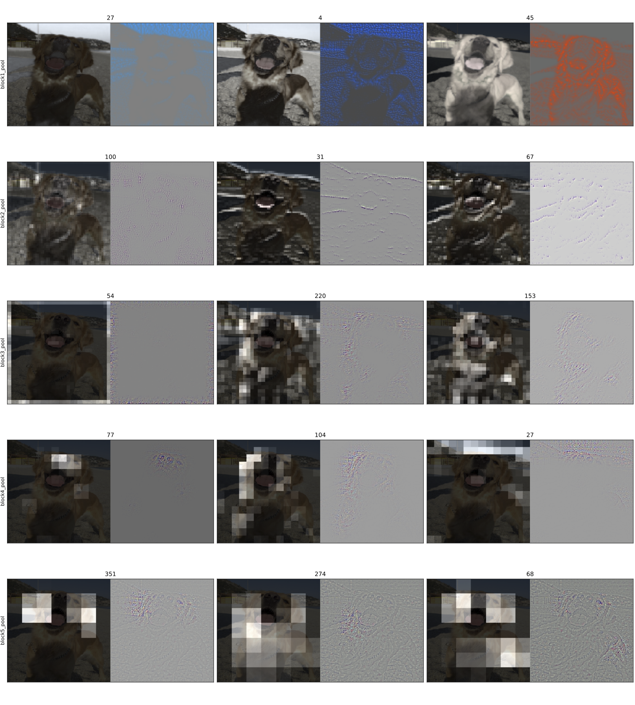

# Visualization of convolutional neural networks

Visualizing VGG16 convnet using deconvnet.

## Requirements

* Python 3
* Tensorflow 1.0
* NumPy
* h5py
* pillow
* Flask (to use the web interface defined in [web_api.py](https://github.com/chan-y-park/visnet/blob/vgg16/api.py).)

## Description

Please see https://chan-y-park.github.io/blog/visualizing_convnet.html for a detailed description of this project.

## Web application

http://chanypark.ddns.net:8000

## Example

### Input Image

### Result of deconvolution

